# Magazine Hashtag Backend

## Descrição

Dos dias 28/08/23 a 01/09/23 ocorreu o Intensivão de JavaScript da escola [Hashtag](https://www.hashtagtreinamentos.com/). O objetivo foi construir o frontend de um e-commerce, ele usa Vite e Tailwind para facilitar o desenvolvimento, mas fora isso é HTML e JavaScript vanilla. Um amigo que havia me chamado para participar e me propôs de tentar criar um backend para o projeto e este foi o resultado.

Criei um projeto de microsserviços com 4 componentes:

- CatalogAPI: fornece os dados de produtos, usa banco de dados PostgreSQL.
- CartAPI: manipula os dados do carrinho do usuário, usa banco de dados Redis (inspirado no eShopOnContainers da Microsoft).
- OrderAPI: manipula os dados dos pedidos, usa banco de dados MongoDB.
- APIGateway: um API Gateway com Ocelot para facilitar o consumo das APIs pelo frontend.

Todos os componentes, incluindo o frontend, foram conteinerizados com Docker.

### Fluxo de venda

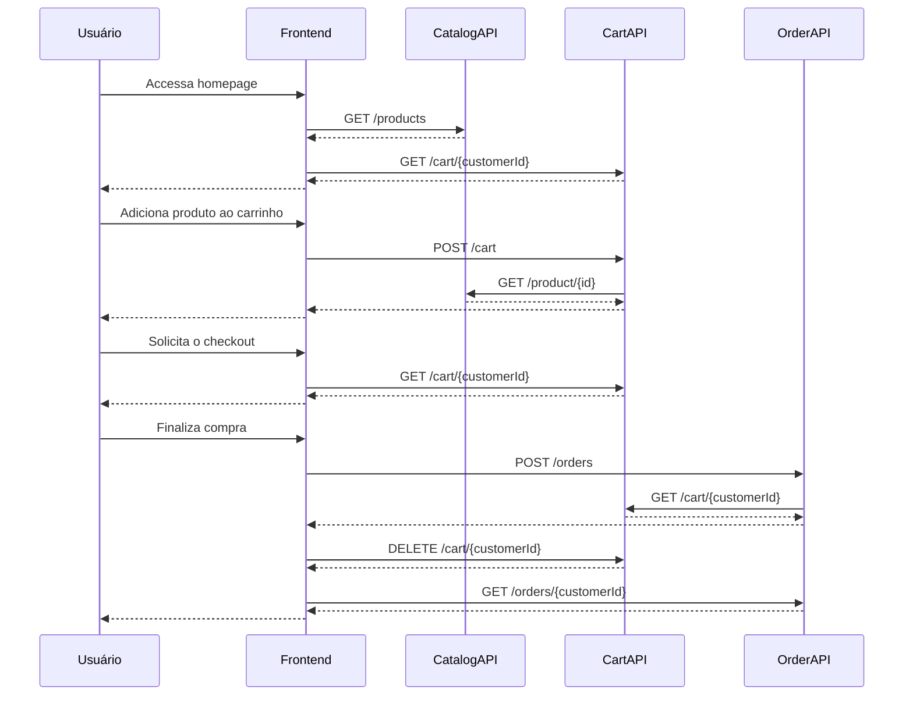

## Execução

Com Docker instalado, para rodar o projeto é só executar o comando `docker compose up` na pasta raiz. O projeto está configurado da seguinte forma:

- Frontend disponível na porta 4173.
- CatalogAPI disponível na porta 7183.
- CartAPI disponível na porta 7218.
- OrderAPI disponível na porta 7186.
- APIGateway disponível na porta 7198.
- PostgreSQL disponível na porta 5432.
- pgAdmin disponível na porta 8080, usuário: <me@example.com>, senha: 1234567.
- Redis disponível na porta 6379.
- Redis Commander disponível na porta 8081.
- MongoDB disponível na porta 27017.
- Mongo Express disponível na porta 8082.

Também é possível rodar o projeto em modo desenvolvimento, por exemplo:

- Com Node.js instalado, executar o comando `npm run dev` na pasta `frontend` para rodar o projeto frontend.
- Rodar os projetos da solução backend através do Visual Studio.

## Limitações

O projeto assume que há um usuário logado interagindo, como não há um sistema de login, um valor que é utilizado como id do usuário é adicionado ao código JavaScript do frontend.

- Executando em modo de desenvolvimento, o valor é passado através da variável `VITE_CUSTOMER_ID` no arquivo `.env`.
- Executando através do docker compose, o valor é passado através do argumento de build `CUSTOMER_ID`.

O projeto não contempla o formulário de checkout com os dados do usuário, pagamento e entrega.

## Imagens

- Homepage
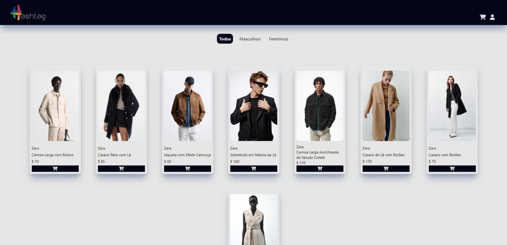
- Swagger CatalogAPI
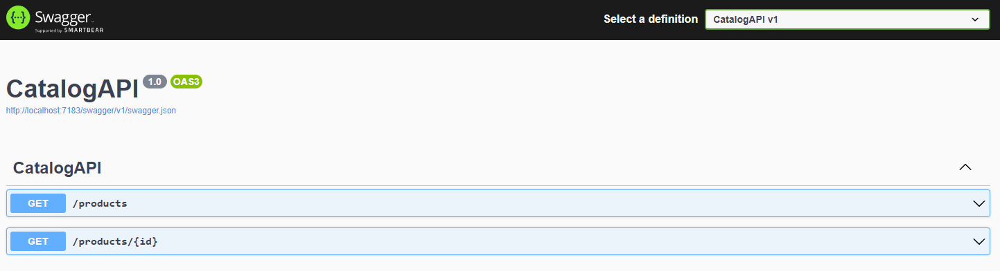
- Banco de dados PostgreSQL
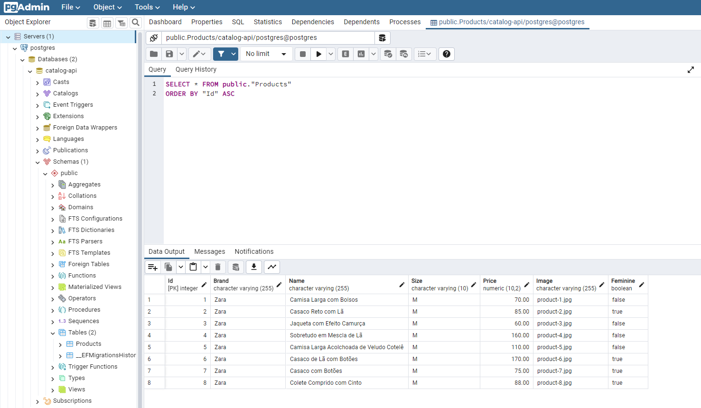
- Carrinho
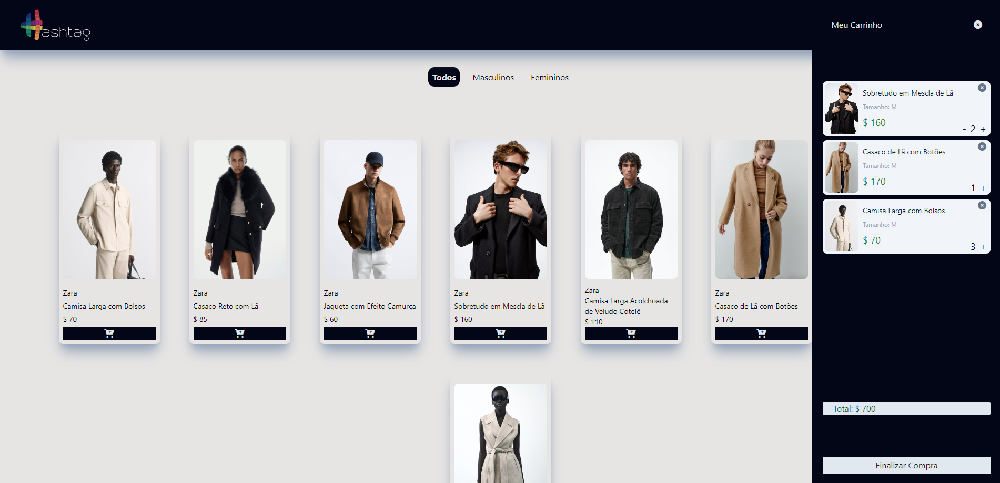
- Swagger CartAPI
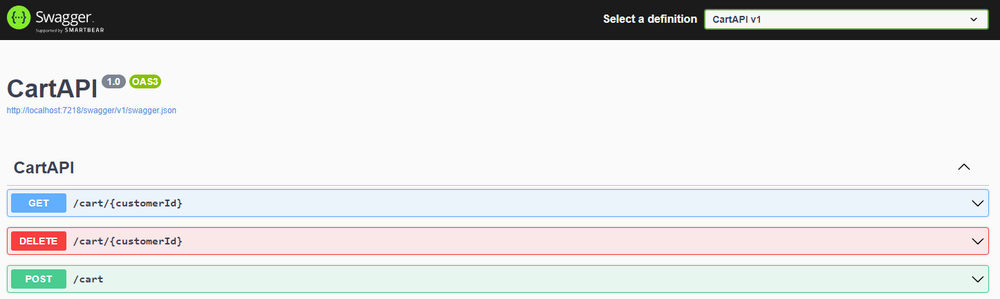
- Banco de dados Redis
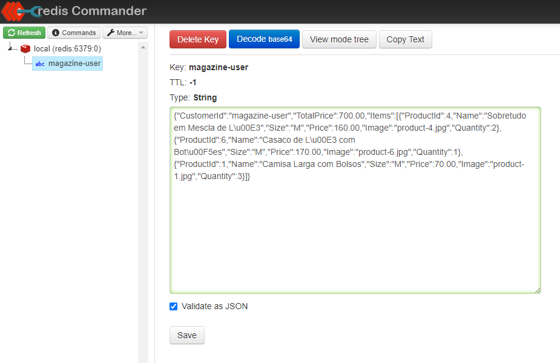
- Checkout
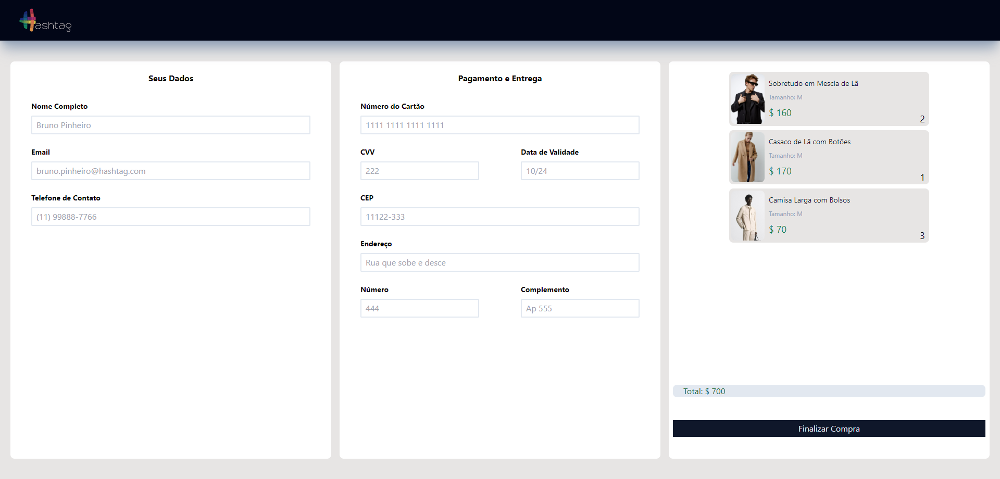
- Pedidos
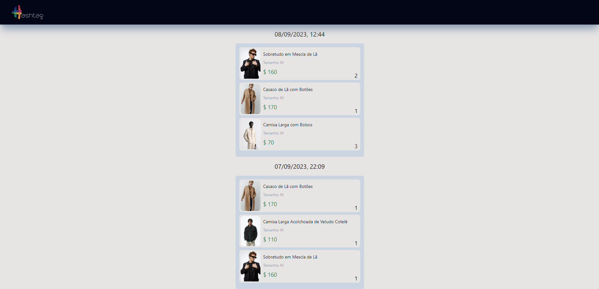
- Swagger OrderAPI
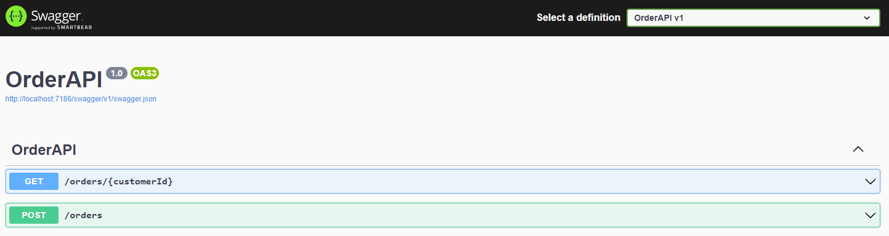
- Banco de dados MongoDB
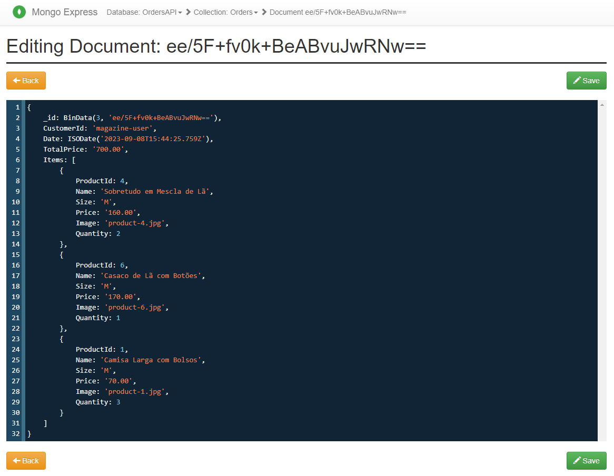
- Contêineres Docker
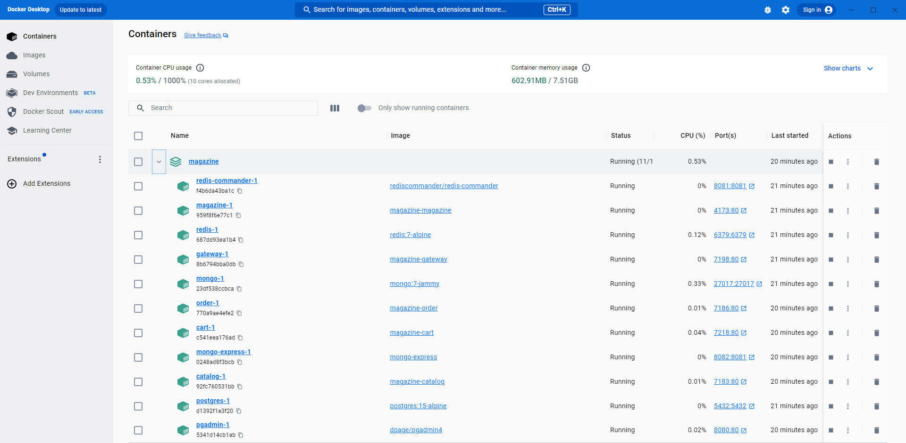

## Referências

[.NET](https://dotnet.microsoft.com/pt-br/)  
[Node.js](https://nodejs.org/en)  
[Vite](https://vitejs.dev/)  
[Tailwind](https://tailwindcss.com/)  
[PostgreSQL](https://www.postgresql.org/)  
[pgAdmin](https://www.pgadmin.org/)  
[Redis](https://redis.io/)  
[Redis Commander](https://joeferner.github.io/redis-commander/)  
[MongoDB](https://www.mongodb.com/pt-br)  
[Mongo Express](https://github.com/mongo-express/mongo-express)  
[Ocelot](https://github.com/ThreeMammals/Ocelot)  
[Docker](https://www.docker.com/)  
[FluentValidation](https://github.com/FluentValidation/FluentValidation)  
[Axios](https://axios-http.com/)  
[eShopOnContainers](https://github.com/dotnet-architecture/eShopOnContainers)  
